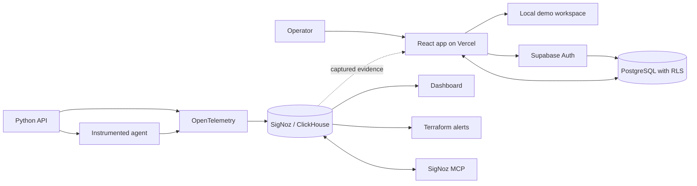

# AgentScope Sidekick

[Live Demo](https://agentscope-sidekick.vercel.app/?demo=1) |
[Authenticated App](https://agentscope-sidekick.vercel.app) |
[Demo Guide](docs/JUDGE_GUIDE.md) |
[Architecture](docs/architecture.md) |
[Latest Release](https://github.com/phanixdev/agentscope-sidekick/releases/latest)

[](https://github.com/phanixdev/agentscope-sidekick/actions/workflows/verify.yml)

I built AgentScope Sidekick to make AI-agent failures easier to investigate. It brings traces, metrics, logs, alert context, and remediation history into one workflow instead of making an operator jump between unrelated tools.

The project was built for Track 1 of the Agents of SigNoz hackathon. It covers tool failures, weak retrieval, token spikes, and latency regressions with OpenTelemetry data stored and queried through SigNoz.

## What It Does

- Shows each agent run as a trace with retrieval, tool, model, and formatting spans.
- Correlates failed spans with the metric threshold and log entry that explain the incident.
- Compares a run with a healthy observed baseline or a clearly labeled deterministic reference.
- Opens breached guardrails directly in the affected investigation.
- Applies a remediation and creates a linked verification run with before-and-after results.
- Supports authenticated, tenant-scoped workspaces through Supabase Auth and PostgreSQL RLS.
- Includes a no-login demo workspace so the full workflow can be reviewed quickly.

## Demo

Open the [demo workspace](https://agentscope-sidekick.vercel.app/?demo=1), then:

1. Select the failed **Tool failure** run.
2. Review the three corroborating signals under **Explain**.
3. Open **Evidence** to inspect the trace ID, span ID, metric query, threshold, rule version, and correlated log.
4. Use **Compare** to find the first divergent span.
5. Run a recommendation from **Remediate** and inspect the linked verification run.
6. Open **Alerts** and investigate a breached guardrail.
7. Open the SigNoz evidence viewer to inspect the captured trace, dashboard, alerts, and raw query artifacts.

The seeded failure uses the same trace ID as the captured SigNoz evidence:

```text
70468b87b41bc6ecbe14d95f30ebcd2c
```

Runs created in the browser receive new trace IDs. The evidence viewer labels those as canonical references and shows both IDs instead of claiming they are the same execution.

## SigNoz Evidence

### Failing Trace


### Dashboard


### Alert Rules


The captured stack contains 14 spans, eight trace-correlated logs, the custom agent metric series, and four Terraform-managed alert rules. Raw MCP, API, ClickHouse, OTLP, and Terraform outputs are kept in [output/telemetry](output/telemetry).

## Track 1 Coverage

| Area | Implementation | Evidence |
| --- | --- | --- |
| Reproducible deployment | Foundry casting and lock file | `infra/casting.yaml`, `infra/casting.yaml.lock` |
| Traces | HTTP-to-agent trace with retrieval, tool, model, and persistence spans | `output/telemetry/mcp-failing-trace.json`, `output/telemetry/otel-all-signals.txt` |
| Metrics | Duration, tokens, tool calls, and retrieval quality | `output/telemetry/signoz-api-metric-proof.json` |
| Logs | WARN and ERROR events correlated by trace and span IDs | `output/telemetry/clickhouse-live-proof.txt` |
| Dashboard | Native multi-signal SigNoz dashboard | `infra/signoz/dashboards.json` |
| Alerts | Four Terraform-managed guardrails | `infra/signoz/alerts.tf` |
| MCP | Trace investigation and dashboard update | `output/telemetry/mcp-dashboard-update.json` |
| Product workflow | Explanation, comparison, alert drill-down, notes, and remediation | `apps/web/src/main.jsx` |
| Tenant security | Supabase Auth, RLS, and policy tests | `docs/security.md`, `supabase/tests/rls_isolation.sql` |

## Architecture



The hosted app has two data paths. Demo mode uses deterministic browser-local data and resets on refresh. Authenticated workspaces store tenant-scoped data in Supabase. The reproducible telemetry stack runs the Python services, OpenTelemetry pipeline, SigNoz, ClickHouse, MCP server, dashboard, and alert rules.

See [docs/architecture.md](docs/architecture.md) for the full flow, evidence identity rules, trust boundaries, and deployment topology.

## Repository Layout

```text
apps/web                 React product
apps/api                 Incident API
apps/agent               Instrumented demo agent
supabase                 Schema, RLS policies, RPCs, and policy tests
infra                    Foundry, OpenTelemetry, SigNoz, and Terraform
output/signoz            Captured SigNoz screenshots
output/telemetry         Raw query and deployment evidence
docs                     Architecture, security, demo, and submission notes
tests                    Product and infrastructure contract tests
```

## Local Setup

```powershell
npm install
Copy-Item .env.example .env.local
npm.cmd run dev
```

The app opens in local demo mode when Supabase variables are absent. To enable authenticated workspaces, set:

```text
VITE_SUPABASE_URL
VITE_SUPABASE_ANON_KEY
```

Apply the migrations in [supabase/migrations](supabase/migrations) before using the authenticated path. The publishable key is safe to expose in the browser; access control is enforced by workspace membership and RLS.

## SigNoz Stack

```powershell
cd infra
foundryctl gauge -f casting.yaml
foundryctl cast -f casting.yaml
docker compose -f pours/deployment/compose.yaml --profile demo-once run --rm agentscope-demo-agent
```

Local services:

```text
http://127.0.0.1:5173  Web app
http://127.0.0.1:8088  Incident API
http://127.0.0.1:8080  SigNoz
http://127.0.0.1:8000  SigNoz MCP server
```

## Tests

```powershell
npm.cmd run check
.\scripts\verify_demo.ps1
```

`npm.cmd run check` builds the production bundle, runs the Node rule-engine tests, and runs the Python product, security, infrastructure, provenance, responsive-layout, and telemetry tests. The same gate runs in GitHub Actions.

## Security

- No service-role credential is included in the browser bundle.
- RLS is enabled on every user-facing table.
- Workspace membership scopes runs, spans, logs, alerts, notes, and remediation history.
- Only owners and admins can modify alert rules.
- Policy and RPC privileges are covered by pgTAP tests.

More detail is available in [docs/security.md](docs/security.md).

## License

This project is available under the [MIT License](LICENSE).

## AI Assistance

I used OpenAI Codex and ChatGPT while planning and implementing parts of this project. Runtime diagnoses do not depend on unconstrained model output: the product uses versioned rules and telemetry evidence, with a deterministic fallback.
