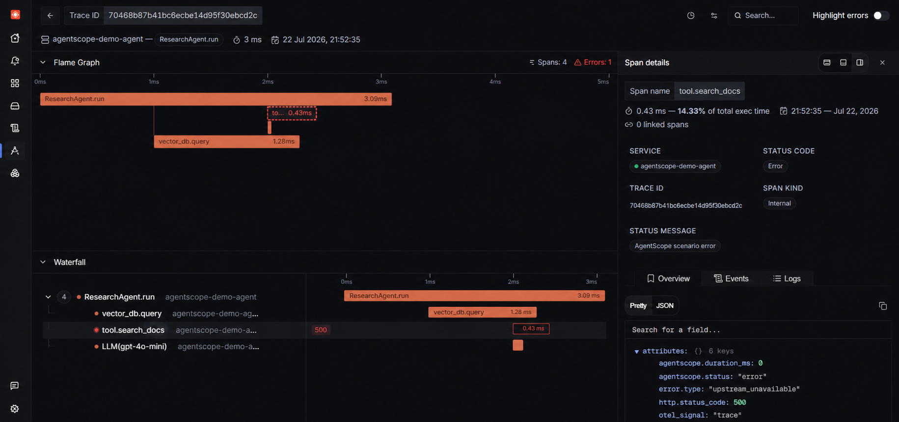
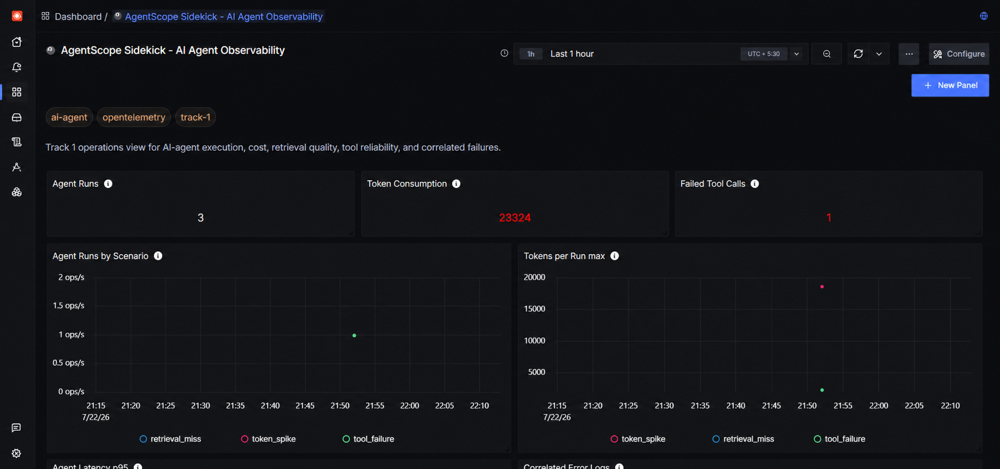
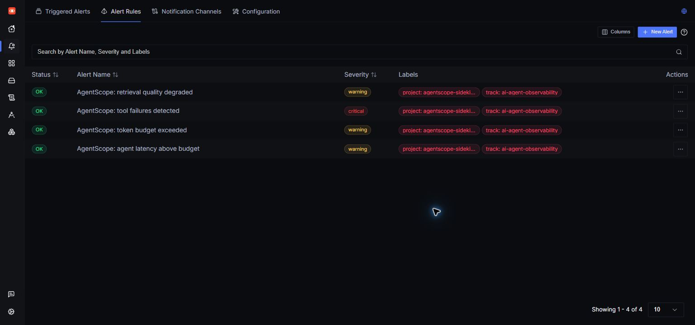
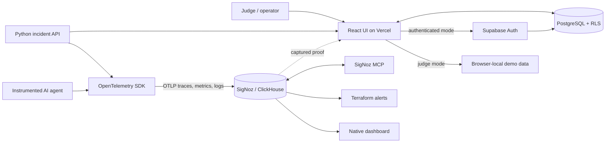

# AgentScope Sidekick

[](https://github.com/phanixdev/agentscope-sidekick/actions/workflows/verify.yml)

**Live judge demo:** https://agentscope-sidekick.vercel.app/?demo=1
**Authenticated product:** https://agentscope-sidekick.vercel.app
**Source:** https://github.com/phanixdev/agentscope-sidekick

AgentScope Sidekick is a production-shaped AI agent observability product for Track 1 of the Agents of SigNoz hackathon. It turns correlated OpenTelemetry traces, metrics, and logs into evidence-backed incident explanations for tool failures, retrieval misses, token spikes, and latency regressions.

## Judge It in 90 Seconds

1. Open the [one-click judge demo](https://agentscope-sidekick.vercel.app/?demo=1). No account or email confirmation is required.
2. Select the failed `Tool failure` run and inspect **Explain**: confidence is backed by three visible corroborating signals.
3. Open **Evidence** to verify the trace ID, anomalous span ID, capture time, metric query, threshold, and correlated log.
4. Open **Compare** to see the first divergent span against a 24-hour healthy peer baseline.
5. In **Alerts**, choose **Investigate** on a breached guardrail to deep-link into its affected run and evidence.
6. Choose **View SigNoz proof** for the captured failing trace, native dashboard, deployed alerts, MCP JSON, metric API response, and Terraform apply output.
The hosted judge workspace is deliberately zero-friction and uses deterministic demo data. Authenticated production workspaces persist under Supabase RLS. The reproducible Foundry stack emits and queries the real traces, metrics, and logs shown below.

## Live SigNoz Proof

### Correlated failing trace



### Native all-signals dashboard



### Terraform-managed alert guardrails



The verified stack ingested **14 spans**, **8 trace-correlated logs**, every custom agent metric series, and **4 Terraform-managed alert rules**. SigNoz MCP read the failing trace and updated the native dashboard; raw query and apply evidence is committed under `output/telemetry/`.

### Track 1 coverage matrix

| Scoring surface | Implementation | Verifiable evidence |
| --- | --- | --- |
| Foundry reproducibility | Locked SigNoz + MCP deployment | `infra/casting.yaml`, `infra/casting.yaml.lock` |
| OpenTelemetry traces | Agent, LLM, retrieval, and tool span trees | `output/telemetry/mcp-failing-trace.json` |
| Metrics | Duration, tokens, tool calls, retrieval quality | `output/telemetry/signoz-api-metric-proof.json` |
| Correlated logs | Trace/span IDs on WARN and ERROR events | `output/telemetry/clickhouse-live-proof.txt` |
| Native dashboard | Multi-signal Track 1 operations dashboard | `infra/signoz/dashboards.json` |
| Alerts | Four Terraform-managed guardrails | `infra/signoz/alerts.tf`, `output/telemetry/terraform-alerts-apply.txt` |
| SigNoz MCP | Trace investigation and dashboard update | `output/telemetry/mcp-dashboard-update.json` |

## Winning Track 1 Story

1. Trigger a realistic bad agent run.
2. Open the breached SigNoz guardrail and deep-link to its affected run.
3. Correlate the anomalous span, metric threshold, and trace-matched log.
4. Compare the incident with a healthy 24-hour peer baseline and isolate the first divergent span.
5. Save the investigation handoff and inspect the matching SigNoz execution proof.

The diagnosis is deterministic and never invents a cause. The UI shows `3/3 signals corroborated`, exposes the confidence formula, and links every conclusion to the trace ID, span ID, metric query, capture time, threshold comparison, and correlated log used as evidence.

### Judge-visible differentiation

- **Alert to root cause in two clicks:** every guardrail opens the matching run with breached metric context.
- **Regression comparison:** duration, tokens, retrieval quality, and cost are compared with healthy peer baselines.
- **Auditable confidence:** a readable signal count is primary; the numeric score is secondary and formula-backed.
- **Operational SLOs:** run success, p95 latency, tool reliability, token compliance, and retrieval quality share one telemetry source.
- **Proof without trust:** screenshots are paired with raw MCP, SigNoz API, ClickHouse, and Terraform artifacts.

## Complete Product

- Supabase email/password authentication, reset flow, and persistent sessions.
- Multi-tenant workspaces with owner/admin/member/viewer roles.
- PostgreSQL schema with RLS on every user-facing table.
- Indexed agent runs, spans, logs, alerts, and investigation notes.
- Transactional onboarding that seeds a judge-ready incident workspace.
- Authenticated demo-run RPC for tool failure, retrieval miss, and token spike scenarios.
- Responsive run explorer, overview, alert management, team view, working run/log filters, loading, error, empty, and toast states.
- One-click judge demo in every environment, plus local preview mode when Supabase variables are absent.
- Live SigNoz, OpenTelemetry collector, MCP, Terraform alerts, and native dashboard assets.

## Architecture



The hosted authenticated product uses Supabase directly under RLS; its judge mode is deterministic and requires no account. The full Foundry path adds the Python API and live SigNoz telemetry pipeline. The UI links each investigation to committed SigNoz execution evidence so the data source is explicit.

See [the complete architecture flow](docs/architecture.md) for the signal lifecycle, trust boundaries, and repository ownership map.

## Local Product

```powershell
npm install
Copy-Item .env.example .env.local
# Set VITE_SUPABASE_URL and VITE_SUPABASE_ANON_KEY
npm.cmd run dev
```

Without `.env.local`, the same UI opens in browser-local preview mode. With Supabase configured, unauthenticated visitors can still choose **Explore judge demo** without creating an account.

Apply `supabase/migrations` to a Supabase project, then configure these Vercel variables:

```text
VITE_SUPABASE_URL
VITE_SUPABASE_ANON_KEY
```

The publishable Supabase key is intentionally browser-safe; authorization is enforced by RLS and workspace membership policies.

## Full SigNoz Stack

```powershell
cd infra
foundryctl gauge -f casting.yaml
foundryctl cast -f casting.yaml
```

Services:

```text
http://127.0.0.1:5173  AgentScope Sidekick
http://127.0.0.1:8088  Sidekick API
http://127.0.0.1:8080  SigNoz
http://127.0.0.1:8000  SigNoz MCP server
```

Emit all three signals into SigNoz:

```powershell
docker compose -f pours/deployment/compose.yaml --profile demo-once run --rm agentscope-demo-agent
```

The native dashboard is `infra/signoz/dashboards.json`. Four deployed alert rules are defined in `infra/signoz/alerts.tf`, with judge-readable runbooks in `infra/signoz/alerts.json`.

## Verification

```powershell
npm.cmd run check
.\scripts\verify_demo.ps1
```

The 26-test suite covers explanations, dynamic incidents, confidence provenance, healthy baselines, alert deep links, Supabase RLS contracts, Foundry artifacts, dashboard schema, alert rules, and all-signal OpenTelemetry evidence. GitHub Actions runs the production build and complete suite on every push and pull request. Browser QA covers authenticated sign-in, transactional onboarding, demo-run creation, investigation notes, alerts, desktop, and mobile layouts.

## Security

- No service-role key is shipped to the browser.
- Every product table has RLS enabled.
- Workspace membership scopes all run, span, log, and alert reads.
- Only owners/admins can update alert rules.
- Investigation notes are private to their author.
- Secrets and local environment files are ignored by Git.

## AI Usage Disclosure

This project was planned and implemented with assistance from OpenAI Codex / ChatGPT. Product explanations are grounded in telemetry evidence and have a deterministic fallback when no model key is configured.
