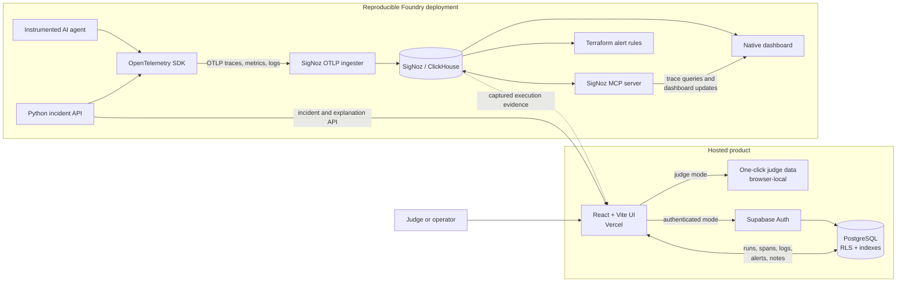
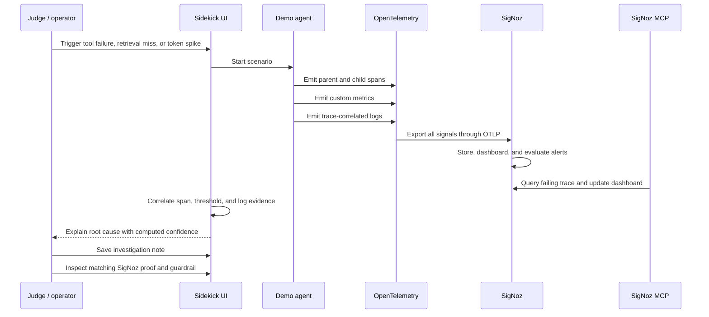

# AgentScope Sidekick Architecture

## System Flow

## Investigation Lifecycle

## Trust Boundaries

- The browser receives only the Supabase publishable key; authorization is enforced by workspace membership and PostgreSQL RLS.
- Authenticated writes use scoped RPCs or RLS-protected tables. No service-role key is shipped to the client.
- Judge mode is deterministic and browser-local, so reviewers do not need credentials.
- The Foundry lockfile reproduces SigNoz and MCP versions, while Terraform keeps alert rules reviewable.
- Explanations are deterministic: confidence is derived from available anomaly signals, and every conclusion exposes its trace, span, metric, and log evidence.

## Repository Ownership

| Component | Responsibility |
| --- | --- |
| `apps/web` | Product UI, investigation workflow, Supabase client, and evidence viewer |
| `apps/api` | Incident API and deterministic telemetry explanation |
| `apps/agent` | Instrumented scenarios and OpenTelemetry emission |
| `supabase` | Auth-linked schema, onboarding, RLS, indexes, RPCs, and persistence |
| `infra` | Foundry casting, SigNoz dashboard, Terraform alerts, and deployment assets |
| `output/telemetry` | Saved MCP, API, ClickHouse, OTLP, and Terraform verification evidence |
| `tests` | Architecture, signal, dashboard, alert, and incident verification |
