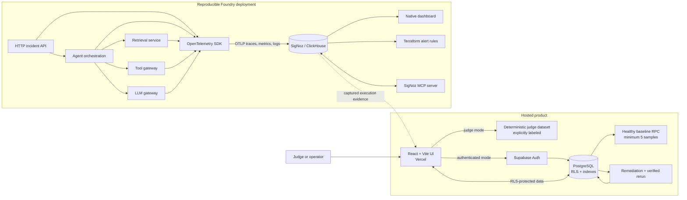
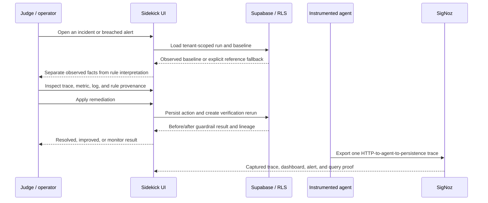

# AgentScope Sidekick Architecture

## System flow



## Investigation lifecycle



## Canonical trace hierarchy

```text
POST /demo/run                         agentscope-api
├── invoke_agent ResearchAgent        agentscope-demo-agent
│   ├── query knowledge_chunks        agentscope-retrieval
│   ├── execute_tool search_docs      agentscope-tool-gateway
│   └── chat gpt-4o-mini              agentscope-llm-gateway
└── INSERT agent_runs                 agentscope-api
```

The hierarchy preserves one trace ID across five services. See `docs/telemetry-contract.md` for semantic attributes and the reproducible capture command.

## Trust boundaries

- The browser receives only the Supabase publishable key; authorization is enforced by workspace membership and PostgreSQL RLS.
- Sensitive RPC execution is revoked from `PUBLIC` and `anon`, then granted to `authenticated` only.
- Authenticated writes use scoped RPCs or RLS-protected tables. No service-role key is shipped to the client.
- Judge mode is deterministic and browser-local. Reference cohorts are visibly distinguished from observed workspace telemetry.
- Observed baselines require at least five healthy tenant-scoped runs. Insufficient data falls back to a disclosed versioned reference.
- The Foundry lockfile reproduces SigNoz and MCP versions, while Terraform keeps alert rules reviewable.
- Diagnosis uses versioned deterministic rules. The UI exposes the rule, query, trace/span IDs, source, and explicit LLM involvement.

## Repository ownership

| Component | Responsibility |
| --- | --- |
| `apps/web` | Investigation, provenance, remediation, recovery states, Supabase client, and proof viewer |
| `apps/api` | HTTP trace root, incident persistence, and deterministic explanation API |
| `apps/agent` | Cross-service agent, retrieval, tool, model, metric, and log instrumentation |
| `supabase` | Auth-linked schema, RLS, baseline RPC, remediation history, and pgTAP proof |
| `infra` | Foundry casting, SigNoz dashboard, Terraform alerts, and deployment assets |
| `output/telemetry` | Canonical OTLP plus saved MCP, API, ClickHouse, and Terraform evidence |
| `tests` | Product, security, provenance, trace hierarchy, and evidence contracts |