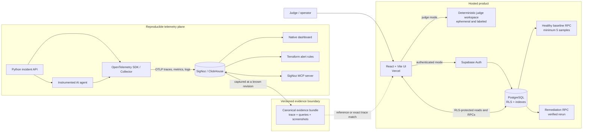
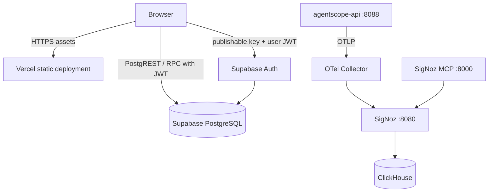
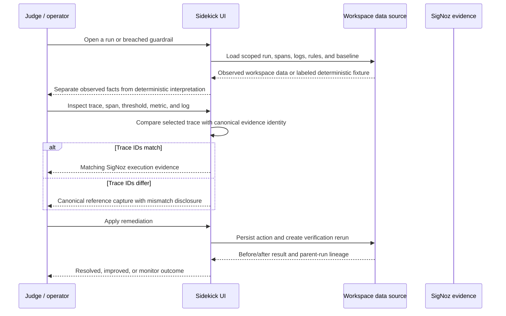
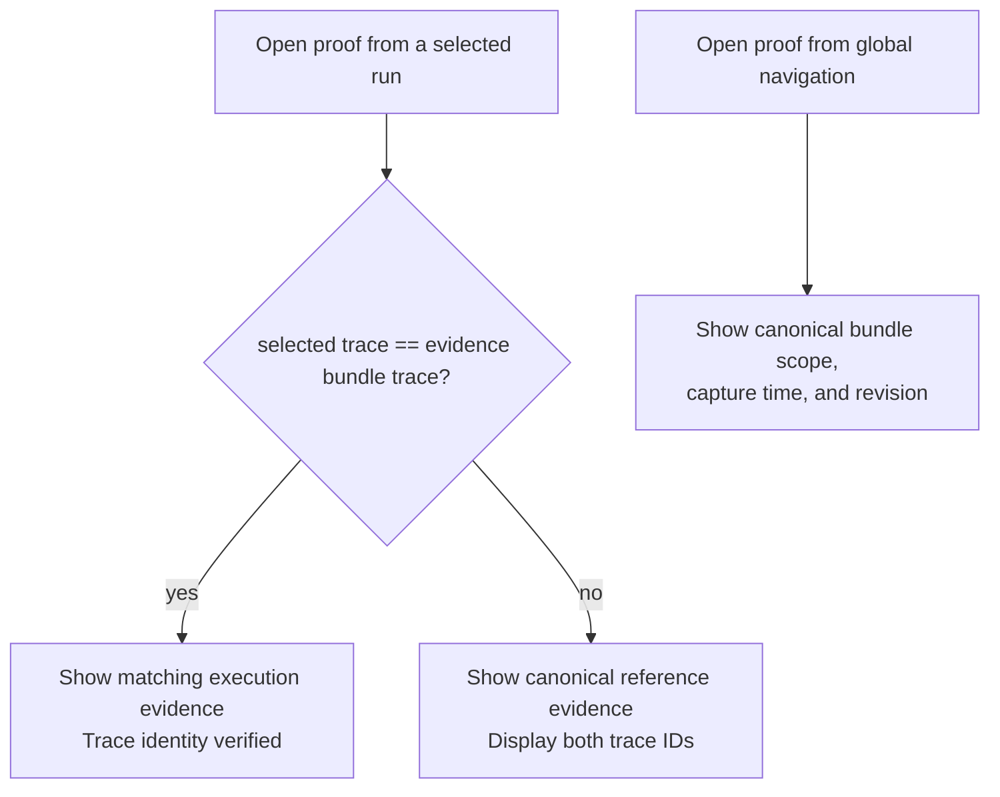

# AgentScope Sidekick Architecture

## Design Goals

AgentScope Sidekick is designed around four invariants:

1. Every diagnosis must resolve to observable facts: a trace, span, metric evaluation, and correlated log.
2. Browser-local judge data, authenticated workspace telemetry, and captured SigNoz evidence must never be presented as the same data class.
3. Authorization is enforced in PostgreSQL through workspace membership and row-level security, not by trusting browser state.
4. The complete SigNoz deployment is reproducible from versioned Foundry and Terraform assets.

## Execution Planes

The system has two connected execution planes with an explicit evidence boundary.

| Plane | Runtime | Responsibility | Persistence |
| --- | --- | --- | --- |
| Hosted product | React/Vite on Vercel | Investigation UI, authentication, comparisons, alert routing, notes, and remediation | Supabase PostgreSQL for authenticated workspaces |
| Judge workspace | Browser-local deterministic data | Zero-credential evaluation with versioned incidents and reference cohorts | Ephemeral; resets on refresh |
| Telemetry plane | Foundry, OpenTelemetry, SigNoz, ClickHouse, MCP, Terraform | Real signal ingestion, queries, dashboards, and deployed guardrails | SigNoz/ClickHouse |
| Evidence bundle | Versioned repository artifacts | Reproducible proof for the canonical captured execution | Git commit plus release tag |

## System Context



## Deployment Topology



The hosted product does not require the Foundry network to remain publicly exposed. The hosted app includes a no-login demo and a revision-pinned evidence bundle. The repository retains the deployment inputs needed to reproduce that bundle.

## Investigation Flow



## Evidence Identity

Evidence is classified before it is displayed.

| Data class | Identity | Source label | Proof behavior |
| --- | --- | --- | --- |
| Canonical captured incident | Trace `70468b87b41bc6ecbe14d95f30ebcd2c`, revision `c83b4f7` | SigNoz / OpenTelemetry | May show "Matching SigNoz execution" when the selected trace is identical |
| Deterministic seed incident | Versioned fixture ID and trace ID | Deterministic judge dataset or SigNoz / OpenTelemetry, as declared by the fixture | Uses exact-match proof only when its trace equals the canonical capture |
| Dynamic judge incident | Fresh 32-character trace and 16-character span IDs | Ephemeral judge dataset | May inspect the canonical reference, but the UI must disclose that trace IDs differ |
| Verification rerun | Fresh trace linked to a parent run | Ephemeral verification rerun or authenticated workspace | Excluded from active breach counts after guardrails pass |
| Authenticated run | Database identity scoped by workspace | Workspace telemetry | Uses persisted run data; captured repository proof remains a separately labeled reference unless identities match |

## Proof Resolution



The proof viewer never rewrites a selected run's identity and never claims that a dynamic run exists in the captured SigNoz bundle.

## Canonical Trace

```text
POST /demo/run                         agentscope-api
|-- invoke_agent ResearchAgent        agentscope-demo-agent
|   |-- query knowledge_chunks        agentscope-retrieval
|   |-- execute_tool search_docs      agentscope-tool-gateway
|   `-- chat gpt-4o-mini              agentscope-llm-gateway
`-- INSERT agent_runs                 agentscope-api
```

One trace ID is preserved across the HTTP request, agent orchestration, retrieval, tool, model, and persistence spans. See `docs/telemetry-contract.md` for semantic attributes and capture commands.

## Trust Boundaries

| Boundary | Allowed data | Enforcement |
| --- | --- | --- |
| Browser to Supabase | Publishable key, user JWT, tenant-scoped rows | Supabase Auth plus PostgreSQL RLS |
| Browser to judge workspace | Versioned deterministic fixtures | Explicit ephemeral labels and refresh reset |
| Authenticated RPC execution | Current workspace member | `PUBLIC` and `anon` revoked; `authenticated` granted |
| Alert administration | Owner/admin workspace members | RLS policies and scoped updates |
| Investigation notes | Author inside current workspace | Membership and author policies |
| Telemetry to SigNoz | OTLP traces, metrics, and logs | Collector endpoint inside Foundry deployment |
| Repository proof to product | Read-only captured artifacts | Trace comparison, revision, capture time, and scope disclosure |

No service-role credential is shipped to the browser. The service-role path is not part of the client architecture.

## Failure Behavior

| Failure | Product behavior | Data guarantee |
| --- | --- | --- |
| Supabase unavailable | Show recoverable workspace error and judge-demo fallback | Existing telemetry is not modified |
| Slow workspace load | Show progressive loading status | No synthetic success state |
| No healthy observed baseline | Fall back to a versioned deterministic reference with a reason | No claim of peer aggregation |
| No runs after filtering | Show a filter-empty list and no unrelated inspector | Selected evidence remains consistent with visible results |
| Alert paused | Exclude the rule from active navigation count while retaining investigation history | Historical breach evidence remains available |
| Remediation succeeds | Create a separately labeled verification run | Verification does not inflate active breach counts |
| Selected trace differs from proof | Show canonical reference mode and both IDs | No false evidence correlation |

## Repository Map

| Component | Responsibility |
| --- | --- |
| `apps/web` | Authentication, run explorer, evidence boundary, comparisons, alerts, remediation, recovery states |
| `apps/api` | HTTP trace root, incident persistence, deterministic explanation API |
| `apps/agent` | Agent, retrieval, tool, model, metric, and log instrumentation |
| `supabase` | Schema, RLS, tenant provisioning, baseline RPC, remediation history, pgTAP proof |
| `infra/casting.yaml*` | Reproducible Foundry component and version lock |
| `infra/signoz` | Dashboard schema, Terraform alerts, and runbooks |
| `output/telemetry` | Canonical MCP, API, ClickHouse, OTLP, and Terraform evidence |
| `public/evidence` | Judge-readable screenshots derived from the canonical capture |
| `tests` | Product, evidence identity, security, alert semantics, responsive, and release contracts |

## Reproducing the Stack

1. `foundryctl gauge -f infra/casting.yaml` validates the casting.
2. `foundryctl cast -f infra/casting.yaml` creates the locked SigNoz and MCP deployment.
3. The demo agent emits traces, metrics, and correlated logs through OTLP.
4. Terraform applies the four guardrail rules.
5. MCP and API queries capture the canonical evidence artifacts.
6. `npm.cmd run check` verifies product, security, infrastructure, and evidence contracts.
7. GitHub Actions repeats the release gate.
8. Vercel deploys the exact commit referenced by the release tag.

## Design Decisions

- **Deterministic diagnosis:** root-cause decisions are versioned rules; no LLM is in the decision path.
- **Explicit reference fallback:** comparisons never present deterministic cohorts as observed production peers.
- **Database-enforced tenancy:** RLS is the authorization boundary, while React only reflects allowed state.
- **Captured proof over public infrastructure:** the production UI remains reliable without exposing a temporary SigNoz deployment.
- **Identity before presentation:** proof affordances are derived from trace equality, not from scenario names or visual similarity.
